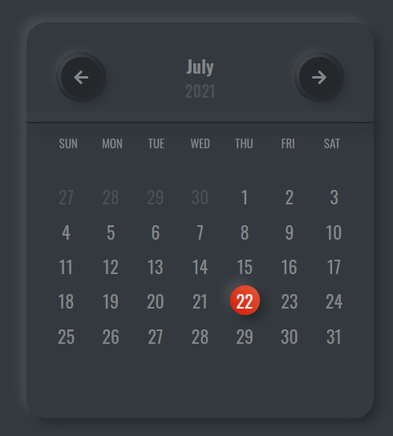

<p align="center">
  <h1 align="center">neumo-calendar-js</h1>

  <p align="center">
  A simple calendar build with JavaScript using neumorphism design.
</p>

## Screenshot


### Built With

* HTML
* SCSS
* JavaScript

<!-- GETTING STARTED -->
## Getting Started

To get a local copy up and running follow these simple example steps.

### Prerequisites

* npm
  ```sh
  npm install npm@latest -g
  ```

### Installation

1. Clone the repo
   ```sh
   git clone https://github.com/akkitheakhil/neumo-calendar-js
   ```
2. Install NPM packages
   ```sh
   npm install
   ```
3. Run the command
   ```sh
   npm start
   ```

#### Template/boilerplate code used -  [https://github.com/akkitheakhil/create-html-scss-js/](https://github.com/akkitheakhil/create-html-scss-js/)

<!-- CONTACT -->
## Contact

Akhil Padmanabhan - speaktoakhilp@gmail.com

Project Link: [https://github.com/akkitheakhil/neumo-calendar-js/](https://github.com/akkitheakhil/neumo-calendar-js/)
